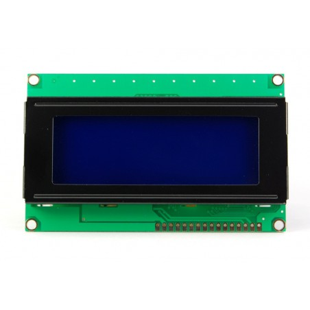

# Methodology and Requirement Analysis

### আমাদের এই Android Comtrol Surveillance Robot তৈরিতে যেসব যন্ত্রপাতি লেগেছেঃ
<br>

# Arduino UNO :
### এটি একটি অপেন সোর্স মাইক্রোকন্ট্রোলার বোর্ড যেটিকে সর্বনিম্ন DC 5V এই অপারেট করা যায়।

### এই বোর্ডে মাইক্রোকন্ট্রোলার হিসেবে আছে ATMega328P IC। যেটি ২৮ পিনের একটি আইসি। এবং ১৪ টি ডিজিটাল পিন এবং ৬ টি অ্যানালগ পিন বিদ্যমান। 


<br>

# L298N Motor Driver Module :
### রোবটকে সামনে চালনার জন্য চাকাকে কন্ট্রোল করার জন্য L298N Motor Driver Module ব্যবহৃত হয়েছে। এটি একটি Dual H Bridge motor driver module যাতে L298N IC ব্যবহার করা হয়েছে। মুলত মাইক্রোকন্ট্রোলার থেকে সিগন্যাল পাওয়ার ভিত্তিতে এই Motor Driver Module স্বয়ংক্রিয়ভাবে চাকাকে সামনে পিছনে ডানে বামে Move করা যাচ্ছে। এবং প্রয়োজনে রোবটের গতিও নিয়ত্রন করা যাচ্ছে।


<br>

# Motor 12V
### এই রোবটের জন্য মোট ৪ টি 12V এর মোটর ব্যবহৃত হয়েছে।


<br>

# Display
### রোবটের বিভিন্ন Activity দেখানোর জন্য 20/4 LCD Display ব্যবহৃত হয়েছে। এটি একটি Alpha Numerical Display যাতে ২০ টি Column এবং ৪ টি Row আছে। মূলত রোবটের Connection Status দেখানোর জন্য Display feature টি ব্যবহৃত হয়েছে। 



<br>

# HC-06 Blutooth
### রোবটকে দূর থেকে কন্ট্রোল এর জন্য সিগন্যাল পাঠানোর জন্য এতে HC-06 Blutooth Module ব্যবহার হয়েছে। Android App থেকে কিছু নির্দিষ্ট সিগন্যাল Module টি Receive করবে এবং সিগন্যাল অনুযায়ী রোবট Responce করবে।


<br>

# Camera
### সারভিলেন্স সিস্টেম এর জন্য এই রোবটের সাথে একটি ESP32 WIFI Camera Module ব্যবহৃত হয়েছে। এতে 2 Mega Pixel এর লেন্স ব্যবহার হয়েছে। এবং এতে একটি SD card ব্যবহার করা যাবে। ক্যামেরা টি WIFI Connection এর মাধ্যমেও দূর থেকে Live Stremming করা যাবে। 


<br>


# LED Light
### অন্ধকারে চলাচলের জন্য রোবটের সামনে পিছনে Led Light ব্যবহার করা হয়েছে।

<br>

# Companion App
### রোবটকে চালানোর জন্য একটি Third Party Android App ব্যবহার করা হয়েছে।

<br>

# Power Supply
### পুরো সিস্টেম কে Powerup করার জন্য 6800Mah এর 3.7V এর ৪ টি লিথিয়াম ব্যাটারি ব্যবহার করা হয়েছে।


# Circuit Diagram:


# Algorithom
```
Step 1: Power On

Step 2: Show initial activity in display and robot stop

Step 3: if the robot get the signal from app
        show connected msg in the display and stop robot

        else show disconnect msg

Step 4: if robot get forward signal
        then Go forward

        else if robot get backward signal
        then Go backward

        else if robot get left signal
        then Go left

        else if robot get right signal
        then Go right

        else robot stop

Step 5: End

```
# Flow Chart


# Coding


